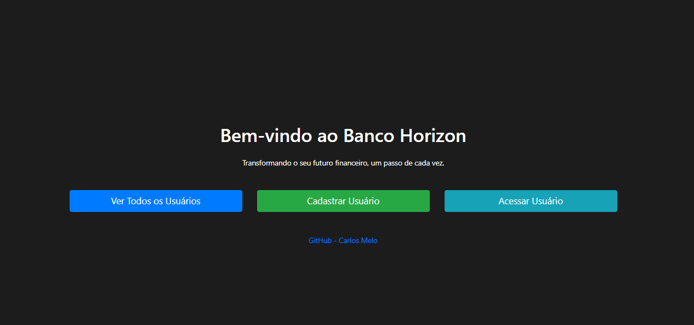

<h1 align="center"> Banco Horizon, Aplicação em Java com Spring Boot </h1>  

<!-- START doctoc generated TOC please keep comment here to allow auto update -->
<!-- DON'T EDIT THIS SECTION, INSTEAD RE-RUN doctoc TO UPDATE -->
## Contents

- [Descrição](#Descrição)
- [Funcionalidades](#Funcionalidades)
- [Tecnologias-utilizadas](#Tecnologias-utilizadas)
- [Requisitos](#Requisitos)
- [Configuração/execução](#Configuração)

<!-- END doctoc generated TOC please keep comment here to allow auto update -->

## Descrição

Este projeto é uma aplicação bancária simples baseada em 
Java com Spring Boot, que permite aos usuários criar contas,
realizar transações e gerenciar seus saldos. A aplicação segue
os princípios de Programação Orientada a Objetos e utiliza Spring
para gerenciamento de dependências, Hibernate para persistência de
dados e Thymeleaf para a camada de visualização.

  

## Funcionalidades

Algumas coisas que essa aplicação se propõe a fazer:

* Ver todos os usuários dentro do banco de dados
* Cadastrar novo usuário / signin
* Logar em um usuário existente / login
* Criar contas
* Cria até 2 contas(poupança e corrente) para cada usuário
* Realiza depositos e saques especificos para o usuário que está logado na sessão
* possibilita a transferência de dinheiro entre contas, com uma lista visual de contas disponíveis para transferência.

  

## Tecnologias-utilizadas

- *Spring Boot*: Framework para criação de aplicativos baseados em *Spring* de forma rápida e fácil.
- *Hibernate*: Framework de mapeamento objeto-relacional para a persistência de dados.
- *Banco de Dados H2*: Utilizado pela praticidade e ja ser integrado ao java.
- *Thymeleaf*: Motor de modelo Java para a web para a criação de páginas da web server-side.
- *Bootstrap*: Framework de design para aprimorar a aparência e a sensação do aplicativo.
- *JavaScript*: Usado para funcionalidades interativas no navegador.

## Requisitos

* Java 17 ( não sei dizer qual versão minima do java que vai funcionar)
* Maven

## Configuração

1º  Clone o repositório do GitHub:

    -git clone https://github.com/carlosmelo4455/desafio-banco.git
2º  Verifique se todas as dependencias do Maven foram importadas.

3º  Inicie a aplicação pelo BancoApplication.java.

4º  Acesse a aplicação em seu navegador: http://localhost:8080.
